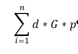
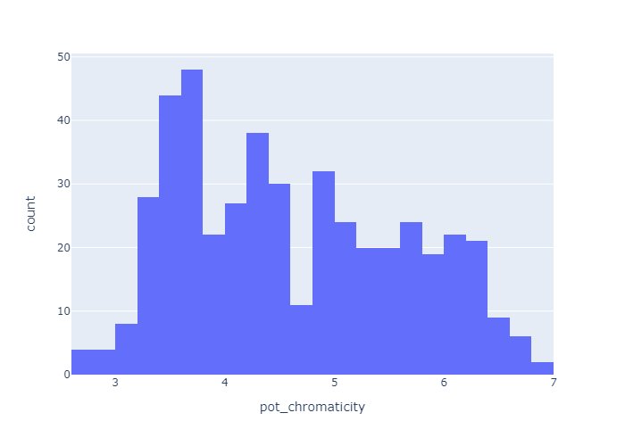
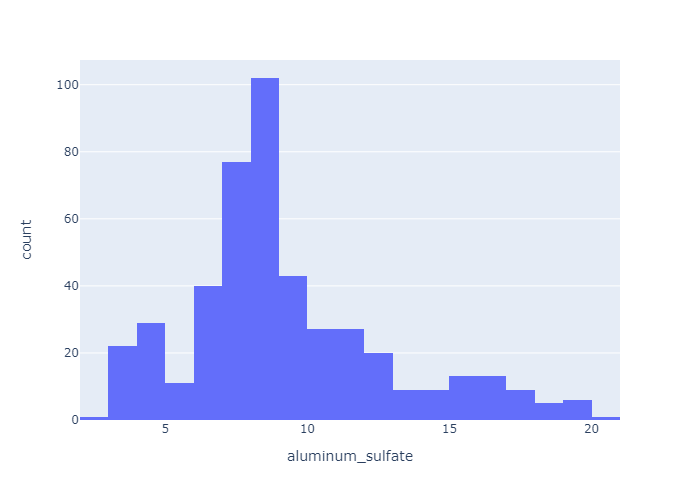
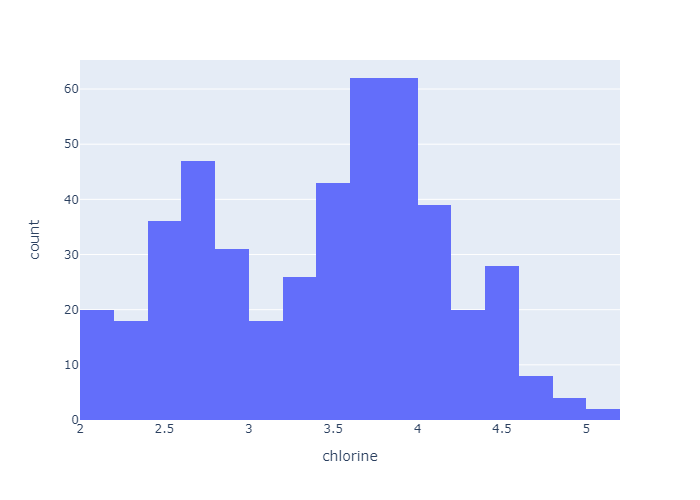
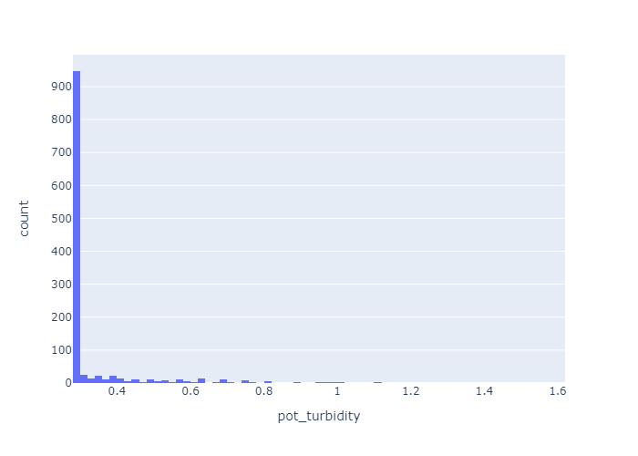
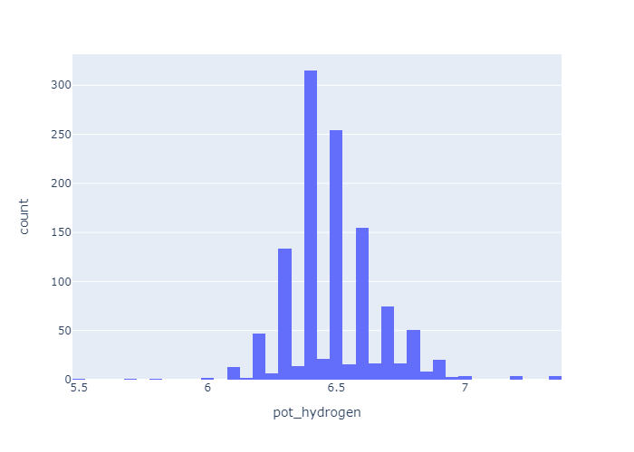
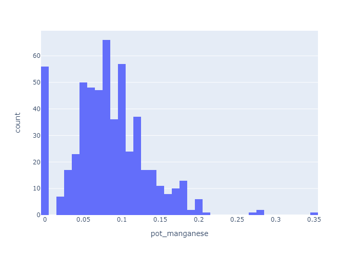
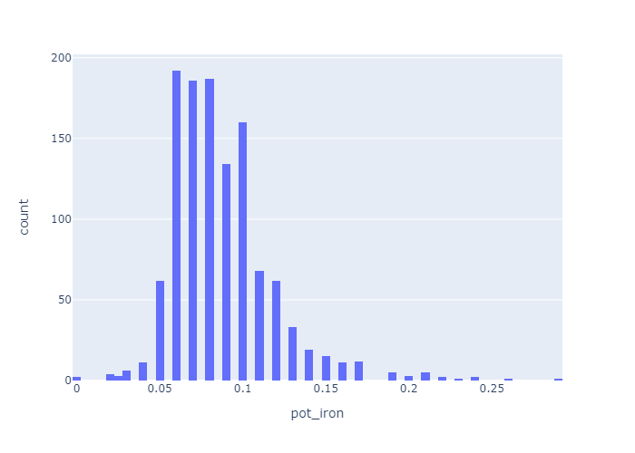

# Цифровой подсказчик технолога ВОС-2

## 1. Цели проекта
Снижение затрат на химические реагенты, используемые в процессе очистки воды 
из поверхностного источника р. Вах (поверхностная вода) до питьевого состояния
(питьевая вода).

## 2. Техническое решение
Для решения вышеуказанной задачи предлагается внедрение цифрового подсказчика,
который должен подбирать оптимальные дозы химических реагентов.

### 2.1. Исходные данные
Исходные данные собираются в системе, развернутой на ВОС-2 г. Нижневартовска
Два раза в день хим. лаборатория заполняет данные о состоянии поверхностной воды,
а технологи - о дозах применяемых реагентов и производительности ВОС-2. 
Дополнительно используются данные из оцифрованных отчетов технологов по расходу реагентов
за 2022-2023 гг.
В качестве исходных данных используются параметры поверхностной воды:
1. Цветность, град.
2. Мутность, мг/дм3. 
3. Водородный показатель, ед. pH. 
4. Щелочность, ммоль/дм3. 
5. Массовая концентрация марганца, мг/дм3. 
6. Массовая концентрация общего железа, мг/дм3. 
7. Массовая концентрация аммиака и ионов аммония (суммарно), мг/дм3.
8. Температура, °С.
9. Массовая концентрация железа (II).

В качестве доз химических реагентов используются дозы (мг/л) следующих ве-ществ:
1. Сульфат алюминия,
2. Оксихлорид алюминия,
3. Перманганат калия,
4. Хлор,
5. Аммиак водный технический,
6. Флокулянт (контактная камера),
7. Флокулянт (фильтры)

### 2.2. Метрики
В качестве метрики оптимизации используется метрика затрат на водоподготовку,
которая вычисляется по формуле:

где:
d - доза реагента, мг/л
G - фактическая производительность очистных, т/ч
p - стоимость реагента, руб/т.

### 2.3. Моделирование
Для решения задачи оптимизации важны не столько метрики качества моделей, 
сколько влияния конкретного параметра на итоговый результат.
Для оптимизации используется Брутфорс оптимизация (или brute-force optimization)
— это метод поиска оптимального решения путем полного перебора всех возможных 
вариантов.

Принцип работы метода заключается в следующем:
1. Перебор всех возможных решений: метод проверяет каждое возможное решение в заданном пространстве решений.
2. Оценка каждого решения: для каждого варианта вычисляется значение целевой функции, которая отражает качество решения.
3. Выбор наилучшего решения: после оценки всех вариантов выбирается решение с наилучшим значением целевой функции.

Иными словами, строится сетка параметров из возможных комбинаций доз реагентов.
Далее в датасету добавляются столбцы с параметрами поверхностной воды.
Значения этих параметров неизменны во всех строках датафрейма.
Затем для каждой строки делается предсказание для параметра питьевой воды, 
регламентруемого СанПиН 1.2.3685-21. 
После чего происходит фильтрация строк, где значения хотя бы одного из 
предсказанных параметров не соответствует СанПиН 1.2.3685-21. 
После чего оптимизатор возвращает дозы реагентов из строки, где значение 
ключевой метрики - стоимости очистки воды наименьшая.
Более подробно параметры СанПиН 1.2.3685-21, которые используются в качестве 
целевых для моделей описаны ниже.
 #### 1. Цветность
Один ключевых параметров. СанПиН 1.2.3685-21 устанавливает значение цветности
в питьевой воде не более 20 градусов. На рисунке ниже показано распределение
значений цветности в питьевой воде.

Данное распределение в обучающей выборке представляет определенную сложность,
так СанПиН допускает значение цветности в питьевой до 20 градусов, что сильно выше чем
максимальные значения в обучающей выборке.

Таким образом алгоритмы, основанные на деревьях решениях для данной модели не подходят.
Придется использовать линейные модели, либо CatBoost, которые могут предсказывать значения,
находящиеся за пределами выборки.

Данный параметр также важен, так как в технологическом процессе очистки по цветности
подбираются значения коагулянта и хлора. Именно комбинация этих двух параметров
снижает цветность со значений в поверхностной воды до питьевых.
Поэтому при моделировании наиболее важна управляемость, чтобы при нулевых дозах 
вышеуказанных реагентов, значения цветности в питьевой воде были максимальные 
и уменьшались с увеличеним доз, как это происходит в реальном технологическом процессе.
распределение значений. 
Распределение доз сульфата алюминия (коагулянт) и хлора
представлено на рисунках

Соответственно, подбор доз должен осуществляться в этих пределах.
В настоящий момент тестируется линейная модель Lasso
Более подробная информация по [ссылке](http://mlflow-dev.apps.ocpd.sib.evraz.com/#/experiments/204/runs/231b1d68aa9e4a70b603dee3fabb8e2b)
Метрика R2 составляет 0,032 (перемешивание данных использованы, данные 2023-2024 годы).
Диаграмма beeswarm в точности описывает процесс.
Также была модель CatBoost без перемешивания данных с R2=0,659 (данные 2022-2023) годы.
Более подробная информация по [ссылке](http://mlflow-dev.apps.ocpd.sib.evraz.com/#/experiments/204/runs/264ca0ed9b624fa1ae9205383388a736)
Но влияние доз сульфата алюминия слишком слабое. При использовании в bruteforce 
доз СА от минимальной к максимальной влияние на таргет - незначительное. 
И даже при нулевой дозе СА таргет получается в пределах нормы, 
что невозможно на практике. 

#### 2. Мутность
СанПин также регулирует значение мутности. Допустимое значение мутности 
питьевой воды составляет 1,5 мг/л.
В рамках технологического процесса, снижение мутности происходит за счет коагуляции.
Распределение мутности питьевой воды представлено на рисунке.

Как видно из текущего распределения целевой метрики, построить корректную модель
на основе текущих данных невозможно.
Наиболее удачная модель была получена на основе алгоритма CatBoost
[ссылке](http://mlflow-dev.apps.ocpd.sib.evraz.com/#/experiments/204/runs/4aabe525b81d4e69872210e53a4c41e0)
R2=0,263 но результаты интерпретации модели по диаграмме beeswarm 
не соответствуют физической интерпретации процесса. Коагулянт снижает мутность, а не увеличивает.

### 3. Водородный показатель
Значения водородного показателя (PH) регламентируется от 6 до 9.
[Текущая модель](http://mlflow-dev.apps.ocpd.sib.evraz.com/#/experiments/204/runs/8cbffcaf6d5e4c0c86fa0b69c52a40eb)
Распределение таргета представлено на рисунке

Согласно тех процессу, данный пизнак корректируется слабо и зависит от PH в поверхностной
воде. PH может расти с увеличением дозы извести, и снижаться с увеличением дозы
коагулянта.

### 4. Марганец
[Текущая модель](http://mlflow-dev.apps.ocpd.sib.evraz.com/#/experiments/204/runs/78c1c67d76574050b56d745f2508673f)
Модель довольно неплохая, единственная модель, корректно отрабатывающая на bruteforce
Распределение таргета представлено на рисунке

СанПиН устанавливает максимальное значение марганца в питьевой воде не более 0,1 мг/л
Модель корректно отрабатывает на bruteforce, так как в выборке представлено достаточно
много случаев превышения данного показателя. Для улучшения управлеямости был
создан комбинированный признак отшение содержания марганца в поверхностной к воде
к дозе перманганата калия. Перманганат калия - основной реагент, снижающий содержания 
марганца в питьевой воде, наряду с хлором.

### 5. Железо
[Текущая модель](http://mlflow-dev.apps.ocpd.sib.evraz.com/#/experiments/204/runs/0f2439cdb64349569395ae5dfafdc0da)
В текущей модели значение метрики R2=-0.015, но при этом модель управляется корректно.
СанПиН допускает содержание железа в питьевой до 0,3 мг/л. 
Распределение показателя представлено на рисунке

Как пример, показана модель с хорошими метриками, но с интерпретацией, неподходящей
под задачу оптимизации.
[Пример](http://mlflow-dev.apps.ocpd.sib.evraz.com/#/experiments/204/runs/713e7e1097ca443c92da9043e234bf6e)
